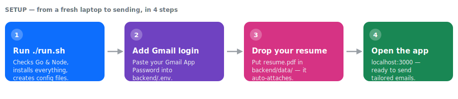
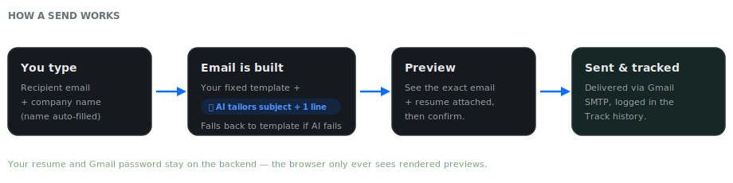
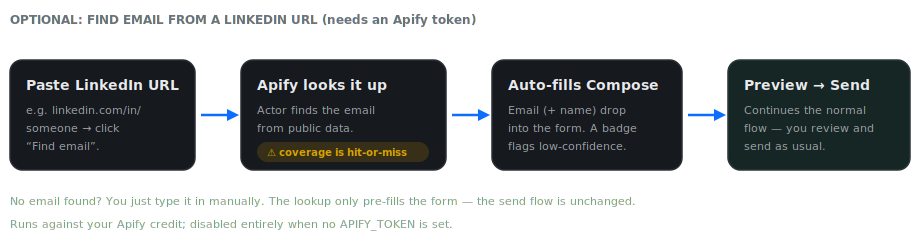
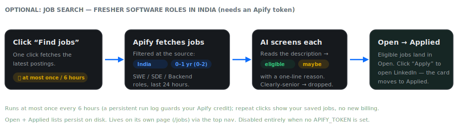
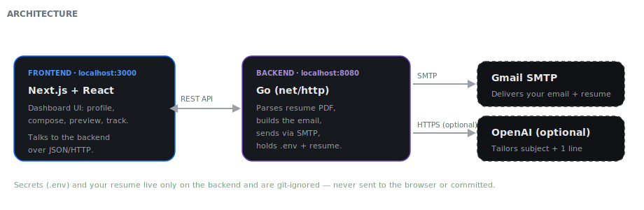

# Resume Cold-Email Sender + Job Search

A local web app with two tools for a fresher's job hunt, reached via a top nav bar:

- **✉️ Email Sender** — send a tailored resume email to any company. Type a
  recipient email + company name, preview a personalized email (built from your
  resume), and send it through your **Gmail** — resume attached automatically.
- **💼 Job Search** (`/jobs`) — find the latest fresher (0–1 yr) software jobs in
  India, AI-screened for eligibility, in an **Open jobs** list; clicking **Apply**
  opens the job on LinkedIn and moves it to your **Applied** list.

- **Backend:** Go (`net/http`, [go-mail](https://github.com/wneessen/go-mail) for SMTP, [ledongthuc/pdf](https://github.com/ledongthuc/pdf) for resume parsing)
- **Frontend:** Next.js + React + Tailwind
- **Email:** Gmail SMTP. The email is built from a **fixed, proven template** (your intro, skills, close, and signature — never altered). When an OpenAI key is set, AI adds only **small tweaks**: a tailored subject line and one company-specific sentence. If AI is off, fails, or returns something weak, it **falls back to the template's own text** — so every email is reliable and sending never breaks.
- **Job Search:** an [Apify actor](https://apify.com/fantastic-jobs/advanced-linkedin-job-search-api) fetches jobs (filtered server-side to India + fresher roles); OpenAI gives each a quick eligibility verdict. Runs **at most once every 6 hours** (a persistent run log guards your Apify credit).
- **Digest:** an on-demand button emails a summary of all your sends to a configured address.

---

## Setup at a glance

From a fresh laptop to sending, in four steps:



## How it works



## Optional: find email from a LinkedIn URL

Don't have the recipient's email? Paste their LinkedIn profile URL and the app
looks it up (via an Apify actor), then pre-fills the compose form — the rest of
the flow is unchanged. This feature only appears when an `APIFY_TOKEN` is set.



## Optional: Job Search (find & track fresher jobs)

A separate page (**💼 Job Search**, at `/jobs`) that finds the latest fresher
(0–1 yr) software jobs in India, has AI check each for eligibility, lists the good
ones under **Open jobs**, and — when you click **Apply** — opens the job on
LinkedIn and moves the card to **Applied**. It only appears when an `APIFY_TOKEN`
is set, and runs **at most once every 6 hours** to protect your Apify credit.



## Architecture



---

## Quick start (one command)

On a fresh machine, from the project root:

```bash
./run.sh
```

`run.sh` checks your tools, creates the config files, installs dependencies, and
launches both servers — then prints the URL to open. It walks you through the two
things it can't do for you: adding your Gmail App Password to `backend/.env` and
dropping your resume at `backend/data/resume.pdf`.

Other modes:

```bash
./run.sh doctor   # just check prerequisites & config, change nothing
./run.sh setup    # install deps + create config, but don't start the servers
```

Press **Ctrl-C** to stop both servers. Prefer to do it by hand? The step-by-step
instructions below still work.

---

## How it works

1. Drop your resume PDF on the backend once.
2. Your profile comes **pre-filled** on first run (name, email, phone, skills, links).
   Adjust anything in the Profile section, or click **Parse from resume** to
   re-extract from the PDF, then **Save profile**.
3. Enter a recipient email + **recipient name** (optional — becomes “Hi {name},”)
   + company name → **Preview** the exact email → **Send**.
4. Every send is logged in the **Track** section (send history).

The email is written in a warm, natural, first-person style (matching a real
job-application voice) — as flowing paragraphs, not bullet points.

Your resume and Gmail password never leave the backend — the browser only ever
sees rendered previews.

---

## Prerequisites

- **Go** 1.22+ (uses the pattern-based `net/http` mux)
- **Node.js** 18+ and npm
- A **Gmail account** with 2-Step Verification enabled

---

## 1. Get a Gmail App Password

Gmail SMTP will **not** accept your normal password. You need a 16-character App Password:

1. Enable 2-Step Verification: <https://myaccount.google.com/security>
2. Create an App Password: <https://myaccount.google.com/apppasswords>
   - Name it anything (e.g. "resume-sender"). Google shows a 16-char password.
3. Copy it (spaces don't matter — `abcd efgh ijkl mnop` works as `abcdefghijklmnop`).

> If you don't see "App passwords", make sure 2-Step Verification is **on** first.

---

## 2. Configure & run the backend

```bash
cd backend

# Create your .env from the template
cp .env.example .env
#   → edit .env and set:
#       GMAIL_USER=you@gmail.com
#       GMAIL_APP_PASSWORD=abcdefghijklmnop

# Put your resume here (exact path/name):
#   backend/data/resume.pdf

go mod tidy
go run .
```

Backend starts on **http://localhost:8080**. On startup it logs whether it found
your resume and credentials:

```
email-sender backend listening on :8080
  resume found: true
  gmail creds:  true
```

---

## 3. Run the frontend

In a second terminal:

```bash
cd frontend
npm install
npm run dev
```

Open **http://localhost:3000**.

The frontend talks to the backend at `http://localhost:8080` (configurable via
`frontend/.env.local` → `NEXT_PUBLIC_API_URL`).

---

## 4. First send (test it on yourself)

Before emailing real companies, send one to **your own email address**:

1. Parse resume → review fields → Save profile.
2. Recipient = your own email, Company = anything.
3. Preview → Send.
4. Check your inbox: correct subject, formatted body, and `YourName_Resume.pdf` attached.

Once that looks right, you're ready to send to real recipients.

---

## Project layout

```
EMAIL_SENDER/
├── backend/
│   ├── main.go                     # HTTP server, routes, CORS, handlers
│   ├── internal/
│   │   ├── config/config.go        # .env loading + validation
│   │   ├── resume/parse.go         # PDF → text → profile extraction
│   │   ├── resume/profile.go       # profile model + JSON persistence
│   │   ├── email/template.go       # subject + HTML/plaintext body rendering
│   │   ├── email/ai.go             # optional OpenAI subject/company-line tweaks
│   │   ├── email/send.go           # go-mail SMTP send with attachment
│   │   ├── email/history.go        # send log (JSON)
│   │   ├── lookup/apify.go         # optional LinkedIn URL → email via Apify
│   │   └── jobs/                   # optional Job Search
│   │       ├── apify.go            # fetch fresher India jobs (server-side filters)
│   │       ├── eligibility.go      # OpenAI eligibility verdict per job
│   │       └── store.go            # open/applied lists + 6h run log (JSON)
│   ├── data/                       # resume.pdf, profile.json, history.json, jobs_*.json (gitignored)
│   └── .env                        # your Gmail creds (gitignored)
└── frontend/
    └── src/
        ├── app/page.tsx            # Email Sender (the stepped flow)
        ├── app/jobs/page.tsx       # Job Search page
        ├── app/layout.tsx          # root layout + top NavBar
        ├── lib/api.ts              # typed backend client
        └── components/             # NavBar, JobSearch, ProfileEditor, ComposeForm, …
```

---

## API reference (backend)

| Method | Path | Purpose |
|--------|------|---------|
| `GET`  | `/api/health` | Server status; whether resume + creds are present |
| `POST` | `/api/parse-resume` | Parse `data/resume.pdf` into an editable profile |
| `GET`  | `/api/profile` | Read the saved profile |
| `PUT`  | `/api/profile` | Save edited profile |
| `POST` | `/api/preview` | `{recipientEmail, company, role?}` → rendered email |
| `POST` | `/api/send` | Same input → sends via Gmail, logs history |
| `GET`  | `/api/history` | List of past sends |
| `POST` | `/api/digest` | Emails a summary of all sends to `DIGEST_TO` |
| `POST` | `/api/lookup` | `{linkedinUrl}` → `{found, email, name, company, …}` via Apify |
| `POST` | `/api/jobs/search` | Fetch + AI-screen fresher India jobs → `{open, added, blocked, retryAfter}`. Rate-limited to once/6h |
| `GET`  | `/api/jobs` | `{open, applied, blocked, retryAfter}` — the saved job lists + rate-limit status |
| `POST` | `/api/jobs/applied` | `{id}` → move a job from Open to Applied → `{open, applied}` |

---

## AI emails & digest (optional)

Add these to `backend/.env`:

```bash
OPENAI_API_KEY=sk-...        # enables AI-written emails
OPENAI_MODEL=gpt-4o          # default; gpt-4o-mini is cheaper
DIGEST_TO=you@gmail.com      # where the "Email digest" button sends
```

- **AI on:** the header shows "✨ AI on". AI only rewrites the **subject** and the
  single **"why this company"** sentence — your intro, skills, close, and
  signature are always the fixed template. The preview badge shows **"Template +
  AI tweaks"**. If the AI sentence doesn't mention the company or looks off, it's
  discarded and the standard company line is used instead.
- **AI off / fails:** leave `OPENAI_API_KEY` unset (or if it errors) — you get the
  **pure template**, badge shows "Template", and the preview tells you why.
- **Digest:** click **Email digest** in the Track section to send a summary of
  all your sends (company, recipient, status, time) to `DIGEST_TO`.

## LinkedIn → email lookup (optional)

Add an Apify token to `backend/.env` to enable the **"Find email from LinkedIn"**
box (see the diagram above):

```bash
APIFY_TOKEN=apify_api_...   # from Apify Console → Settings → Integrations
# Optional — swap the actor or remap its output field without code changes:
# APIFY_ACTOR_ID=snipercoder/linkedin-email-finder
# APIFY_EMAIL_FIELD=email
```

- Paste a LinkedIn profile URL → **Find email** → the result pre-fills the compose
  form. You still Preview → Send as usual. Hidden entirely when no token is set.
- **Coverage is hit-or-miss** — the free/cheap actors often return "no email found"
  even when one exists. When that happens, just type the email in manually.
- **Cost/limits:** lookups run against your Apify credit. Some actors also impose
  their own free-run caps (e.g. a few runs/month); if you hit one, the app shows
  the actor's message. Swap `APIFY_ACTOR_ID` to try a different actor.

## Job Search (optional)

The same `APIFY_TOKEN` also enables the **💼 Job Search** page at `/jobs` (see the
diagram above). No extra secret is needed:

```bash
APIFY_TOKEN=apify_api_...            # same token as the LinkedIn lookup
# Optional — swap the job-search actor without code changes:
# APIFY_JOBS_ACTOR_ID=vIGxjRrHqDTPuE6M4   # fantastic-jobs/advanced-linkedin-job-search-api
```

- **What it does:** one click fetches the latest fresher (0–1 yr) software jobs in
  India — the actor filters by title, location, and experience **server-side**, so
  only relevant jobs come back. OpenAI then gives each a quick verdict
  (**eligible** / **maybe**, with a one-line reason); clearly-senior jobs are
  dropped. Eligible jobs go to **Open**; clicking **Apply** opens LinkedIn and
  moves the card to **Applied**.
- **Rate limit — protects your credit:** a real Apify run happens **at most once
  every 6 hours**. Repeat clicks within that window just show your saved jobs (no
  new billing), and the button is disabled with a "next search in ~Nh" note. Every
  actual run is recorded in `backend/data/jobs_runs.json`.
- **Persistence:** the Open and Applied lists live in
  `backend/data/jobs_open.json` and `jobs_applied.json`, so they survive restarts.
  Jobs are de-duped by id, and an applied job never re-appears in Open.

## Can it tell if someone replied?

**No — not in this version, and it's an honest limitation, not an oversight.**

This app only **sends** mail (outbound SMTP). Knowing whether a recipient
*replied* requires **reading your inbox**, which is a completely different
capability:

- **Gmail API or IMAP** access to your inbox (OAuth or IMAP app password), then
  matching incoming messages by thread / `In-Reply-To` headers to your sends.
- Open/click tracking (a tracking pixel) can hint at *opens*, but it's unreliable
  (blocked by Gmail image proxying) and hurts deliverability — not recommended.

So today, "did they reply?" is answered by **checking your Gmail inbox directly**.
If you want automated reply detection built in, that's a follow-up feature — say
the word and it can be added via the Gmail API (read-only inbox scope).

## Notes & limits

- **Gmail sending limits:** ~500 emails/day for personal accounts. This tool is
  built for targeted, manual sends — not bulk blasting (which hurts deliverability
  and can get your account flagged).
- **Deliverability:** cold emails can land in spam. The template keeps it short,
  specific, and value-first to maximize replies, but a warm intro always beats a
  cold email.
- **Storage:** flat JSON files in `backend/data/` (single-user local tool). No database.
- **Security:** the API has no auth and is intended to run locally only. Don't
  expose port 8080 to the internet.
